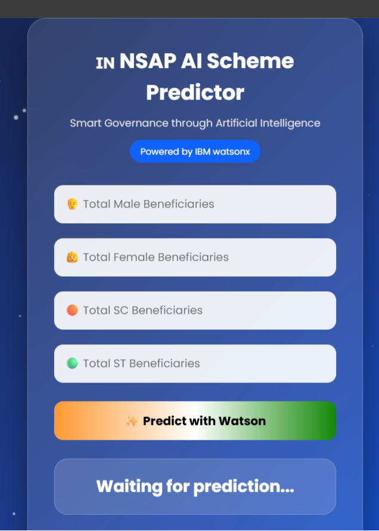
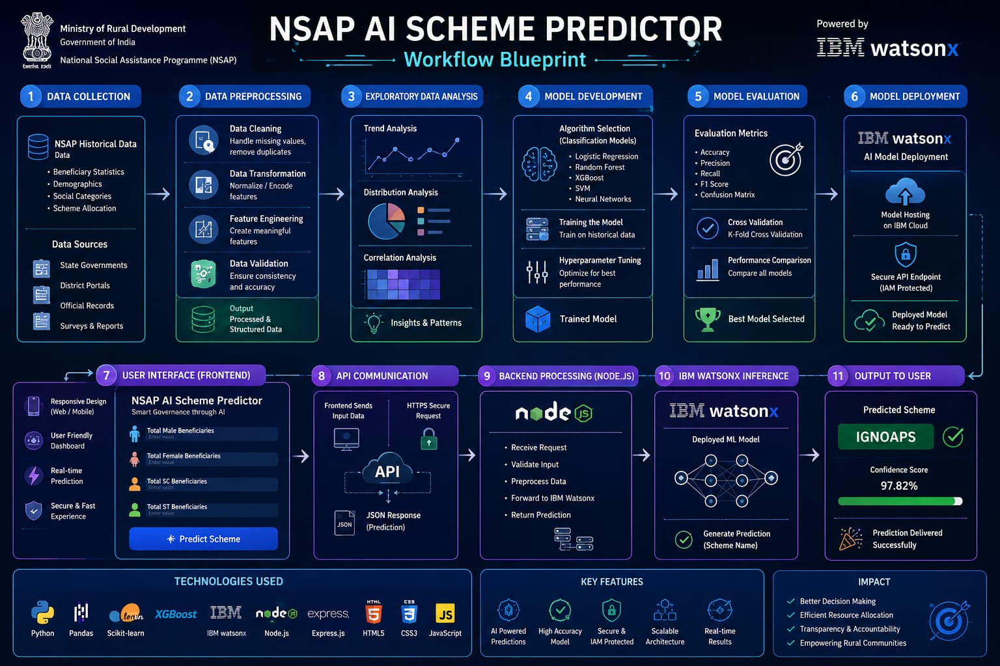

# 🧠 AI-Powered NSAP Scheme Predictor

An AI-powered web application that predicts the most suitable **National Social Assistance Programme (NSAP)** scheme using a Machine Learning model deployed on **IBM watsonx.ai**.

The application provides a simple and responsive interface where users enter beneficiary statistics, and the system communicates with IBM watsonx through a secure REST API to generate real-time predictions.

---

## 📌 Project Overview

The objective of this project is to simplify the process of identifying the appropriate NSAP scheme using Artificial Intelligence.

The frontend is built using HTML, CSS, and JavaScript, while the backend uses Node.js and Express.js to securely connect with an IBM watsonx deployed Machine Learning model.

The prediction model analyzes beneficiary information and recommends the most suitable welfare scheme.

---

## 🚀 Features

- 🤖 AI-powered NSAP scheme prediction
- ☁️ IBM watsonx.ai deployed Machine Learning model
- 🔐 Secure IBM Cloud API authentication
- ⚡ Real-time predictions
- 🎨 Modern responsive user interface
- 🌐 REST API integration
- 📊 Node.js backend with Express.js

---

## 🛠️ Tech Stack

| Technology | Purpose |
|------------|---------|
| HTML5 | Frontend Structure |
| CSS3 | Styling & UI |
| JavaScript | Client-side Logic |
| Node.js | Backend Runtime |
| Express.js | REST API Server |
| IBM watsonx.ai | Machine Learning Deployment |
| IBM Cloud | Model Hosting |
| REST API | Communication between frontend and backend |

---

## 🏗️ Project Architecture

```
User Interface
       │
       ▼
Frontend (HTML, CSS, JavaScript)
       │
       ▼
Node.js + Express Backend
       │
       ▼
IBM Cloud IAM Authentication
       │
       ▼
IBM watsonx.ai Deployment
       │
       ▼
Predicted NSAP Scheme
```

---

## 📂 Project Structure

```
NSAP_BOB_App
│
├── index.html
├── style.css
├── script.js
├── server.js
├── package.json
├── package-lock.json
├── .env
├── .gitignore
├── README.md
│
└── images
      ├── homepage.jpeg
      └── workflow.jpeg
```

---

## 📷 Screenshots

### 🖥️ Application Interface



---

### 🔄 System Workflow



---

## ⚙️ Installation & Setup

### Clone the repository

```bash
git clone https://github.com/MANYA303/NSAP-Scheme-Predictor.git
```

### Navigate into the project

```bash
cd NSAP-Scheme-Predictor
```

### Install dependencies

```bash
npm install
```

### Create a `.env` file

```env
IBM_API_KEY=YOUR_IBM_CLOUD_API_KEY
DEPLOYMENT_URL=YOUR_IBM_DEPLOYMENT_ENDPOINT
```

### Start the backend server

```bash
node server.js
```

### Run the frontend

Open `index.html` using Live Server or visit:

```
http://127.0.0.1:5500
```

---

## 📊 Model Workflow

1. User enters beneficiary details.
2. Frontend sends data to the Node.js backend.
3. Backend authenticates with IBM Cloud IAM.
4. Backend forwards the request to IBM watsonx.ai.
5. Machine Learning model predicts the most suitable NSAP scheme.
6. Prediction is returned and displayed on the webpage.

---

## 🔒 Security

- IBM Cloud API Keys are stored securely using environment variables.
- Sensitive credentials are excluded from GitHub using `.gitignore`.
- Authentication is handled using IBM IAM Tokens.

---

## 📈 Future Enhancements

- 📊 Prediction confidence score
- 📜 Prediction history
- 📉 Interactive analytics dashboard
- 🌙 Dark mode
- 📱 Mobile-first responsive UI
- 📥 Export prediction reports
- 👤 User authentication

---

## 🎯 Learning Outcomes

Through this project, I gained hands-on experience with:

- Machine Learning deployment using IBM watsonx.ai
- IBM Cloud IAM Authentication
- REST API integration
- Backend development with Node.js & Express.js
- Frontend development using HTML, CSS, and JavaScript
- Secure API communication
- Full-stack AI application development

---

## 👩‍💻 Author

**Manya Mishra**

B.Tech in Computer Science (Artificial Intelligence)

---

## 📄 License

This project is developed for educational and academic purposes.
